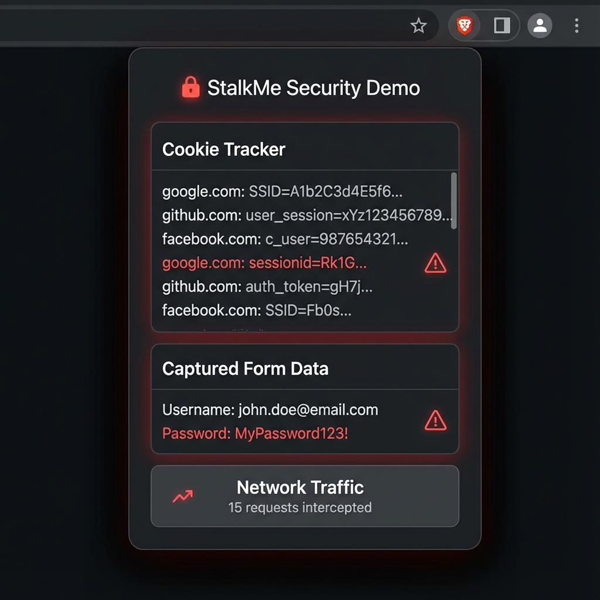
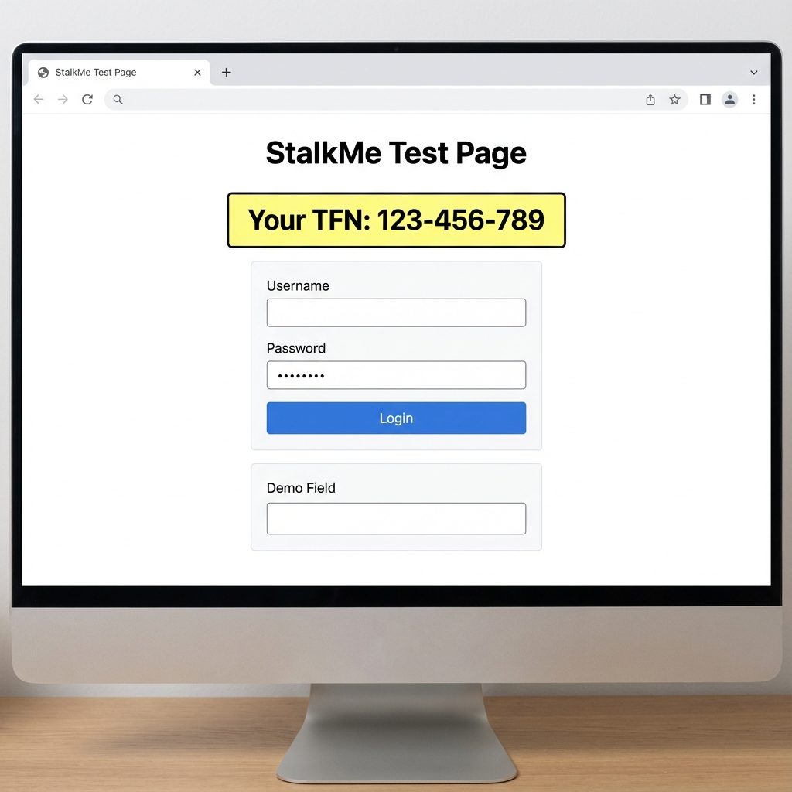
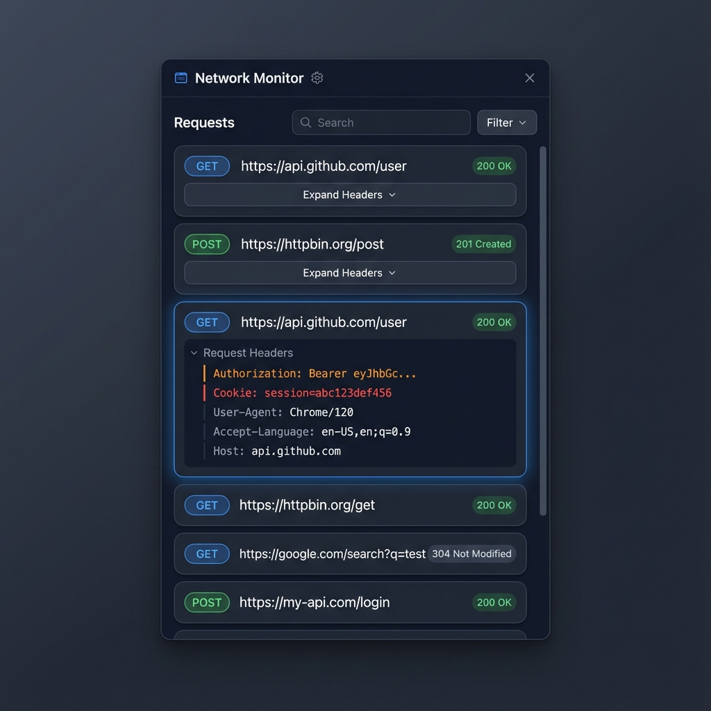

# StalkMe Chrome Extension 🕵️‍♂️

> [!WARNING]
> **Educational Demonstration Only** - This extension intentionally requests excessive permissions to demonstrate security risks. Use only in controlled environments.

**StalkMe** is a demonstration Chrome Extension designed to highlight privacy risks associated with browser extensions that request excessive permissions. This project serves as an educational tool to raise awareness about what malicious extensions could potentially access.

📚 **[Contributing Guidelines](CONTRIBUTING.md)** | 🔒 **[Security Policy](SECURITY.md)** | 📄 **[License](LICENSE)**

*The StalkMe extension interface showing captured cookies, form data, and network traffic*

## Features

*   **🍪 Cookie Tracker**: Displays all cookies across all sites and highlights potential **Session Tokens** in red (based on name patterns and security flags).
*   **🔍 Sensitive Data Scanner**: Scans all open tabs for numbers matching the pattern `xxx-xxx-xxx` or `xxx-xxx-xxxx` (like phone numbers, TFNs, etc.) and displays which tab they were found on.
*   **⚠️ Form Input Monitor**: Demonstrates how extensions can intercept data typed into forms, **including passwords in plaintext**. Captures and displays all form inputs to show the real risk of credential theft.
*   **💉 Content Injection Demo**: Shows how extensions can modify web pages by injecting text into form fields. Demonstrates the ability to manipulate page content without user consent.
*   **🌐 Network Traffic Monitor**: Intercepts ALL HTTP requests/responses and extracts sensitive headers including Authorization tokens, API keys, Cookie headers, and Set-Cookie responses.
*   **🔒 Privacy First**: All analysis happens locally in your browser (no external servers).

## Installation

1.  Clone this repository.
2.  Open Chrome and go to `chrome://extensions`.
3.  Enable **Developer Mode** (top right).
4.  Click **Load unpacked**.
5.  Select the directory containing this extension.
6.  **Important**: Click "Details" on the extension card, scroll down and enable "Allow access to file URLs" to test with `sample_page.html`.

## Usage

1.  Click the extension icon in your browser toolbar.
2.  **Track Me (Refresh Cookies)**: View all cookies and highlighted session tokens.
3.  **Scan Tabs for Numbers**: Scan all open tabs for sensitive numbers in the format `xxx-xxx-xxx`.
4.  **View Captured Data**: See what form data (including **plaintext passwords**) was intercepted by the automatic form monitor.
5.  **Inject "HACKED!" into Page**: Demonstrate content injection by writing to the demo field on `sample_page.html`.
6.  **View Network Traffic**: See captured HTTP requests with Authorization headers, Cookie headers, and other sensitive data.

## Testing

A sample page (`sample_page.html`) is included for demonstration purposes. Open this file in Chrome to test the features:
- **Number scanning**: Contains a randomly generated TFN that changes on each page load
- **Form monitoring**: Has a login form to demonstrate credential interception (monitoring is automatic)
- **Content injection**: Has a demo field that can be filled by the extension

*Sample page for testing form monitoring, number scanning, and content injection*

### Testing Form Monitoring
1. Open `sample_page.html` in Chrome
2. Type a username and password in the login form
3. Open the extension popup
4. Click **"View Captured Data"**
5. See your typed credentials displayed (**passwords shown in plaintext**)

### Testing Content Injection
1. Have `sample_page.html` open
2. Open the extension popup
3. Click **"Inject 'HACKED!' into Page"**
4. Watch the demo field get filled automatically with red styling

### Testing Network Monitoring
1. Browse a few websites (e.g., https://httpbin.org/get, https://github.com, or any site you're logged into)
2. Open the extension popup
3. Click **"View Network Traffic"**
4. See captured HTTP requests with:
   - Request URLs and methods (GET, POST, etc.)
   - Authorization headers and API keys
   - Cookie headers sent with requests
   - Set-Cookie headers from responses
   - HTTP status codes

*Network traffic monitor showing captured HTTP requests with sensitive headers highlighted*

> [!NOTE]
> **File URL Access**: The requirement to enable "Allow access to file URLs" is unique to testing with local HTML files (`sample_page.html`). In real-world scenarios, extensions with these permissions can access **all regular websites** (https:// and http://) without any additional user approval. This testing limitation does not reduce the security implications demonstrated by this extension.

## Permissions & Privacy Risks

This extension requests the following permissions, which demonstrate how much access an extension can have:

### Core Permissions
- **`webRequest`** - Allows the extension to intercept and read all network requests you make. This means it can see every website you visit, every API call, and potentially capture sensitive data in transit.
- **`webRequestBlocking`** - Allows the extension to block or modify network requests. A malicious extension could redirect you to phishing sites, inject malicious code, or prevent security updates.
- **`tabs`** - Grants access to all your open tabs, including titles and URLs. The extension can see your entire browsing session across all tabs.
- **`scripting`** - Allows the extension to inject and execute JavaScript code on any webpage you visit. This could be used to steal passwords, bank details, or modify page content.
- **`cookies`** - Provides access to all cookies from all websites. This includes session tokens that could be used to impersonate you on websites (account takeover).
- **`storage`** - Allows the extension to store data locally. While less risky, this could be used to track your behavior over time.

### Host Permissions
- **`https://*/*` and `http://*/*`** - Grants access to ALL websites you visit, both secure and insecure. Combined with the scripting permission, this is extremely dangerous as it allows the extension to read and modify any webpage.

> [!WARNING]
> **These permissions combined allow an extension to:**
> - Read and steal passwords as you type them (in plaintext)
> - Capture session tokens and impersonate you on websites
> - Intercept ALL network traffic including Authorization headers and API keys
> - Track every website you visit and every HTTP request you make
> - Read sensitive personal information from web pages
> - Modify web pages to inject malicious content or phishing forms
> - Intercept and steal financial information during online banking or shopping
> - Capture authentication tokens from network headers

## Disclaimer

This extension is for **educational and demonstration purposes only**. It requests extensive permissions (`webRequest`, `cookies`, `tabs`, `scripting`, `storage`) to demonstrate how much data an extension can access. **Use with caution** and only install extensions from trusted sources.
